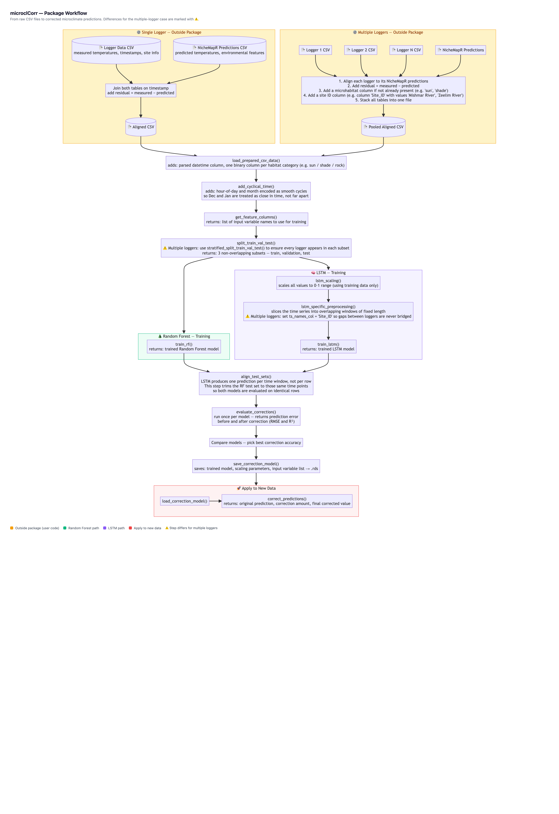

# microclCorr: Correcting Microclimate Model Predictions with Machine Learning

[](https://github.com/levyofi/microcl_ml_corr)
[](https://opensource.org/licenses/MIT)

`microclCorr` is an R package that improves the accuracy of microclimate temperature predictions produced by physical models such as **NicheMapR**.

Physical models like NicheMapR are fundamental tools for understanding how species interact with their thermal environment. By simulating temperatures from first principles — solar radiation, wind, terrain geometry, and heat transfer — they provide mechanistic insight that purely statistical approaches cannot. However, in microhabitats with complex heat balance conditions not yet fully captured by current physical models — such as coastal beaches, where marine winds and sea surface temperatures create rapidly changing microclimates — a residual gap remains between model predictions and field measurements.

`microclCorr` bridges that gap using machine learning. Rather than modifying or replacing the physical model, it learns to predict and correct the residual error from a small set of temperature logger measurements. This eliminates the need to manually re-parameterise the physical model for each specific microhabitat, reducing prediction errors by **58% to 90%** across Mediterranean, coastal, and desert environments.

---

## How it works

NicheMapR predicts a temperature. A field logger measures the actual temperature. The difference between the two is called the **residual**:

```
residual = measured temperature − NicheMapR prediction
```

`microclCorr` trains a model to predict that residual. The corrected temperature is then:

```
corrected temperature = NicheMapR prediction + predicted residual
```

Two model types are available and compared:

- **Random Forest** — an ensemble of decision trees. Fast, robust, and works well even with small datasets.
- **LSTM** — a neural network designed for time-series data. Uses the past 2 hours of measurements to predict the current residual.

---

## Workflow

The diagram below shows the full pipeline from raw CSV files to corrected predictions.



An interactive version is available at [`vignettes/workflow_diagram.html`](vignettes/workflow_diagram.html).

**What you need to provide:**
- A **logger data CSV** — measured temperatures, timestamps, microhabitat label, and environmental variables
- A **NicheMapR predictions CSV** — model-predicted temperatures for the same location and time period

**Your only pre-processing step** (done outside the package):
1. Join both files by timestamp and add a `residual` column (measured − predicted)
2. *(If using multiple loggers)* Add a microhabitat column if not already present, add a site ID column (e.g. `Site_ID` with values like `"Mishmar River"`), then stack all logger tables into one file

See the [preprocessing examples](inst/examples/preprocessing_examples/) for ready-to-run scripts that demonstrate this step on real data.

---

## Installation

### 1. Install the package

```R
# Install devtools if you haven't already
if (!requireNamespace("devtools", quietly = TRUE)) install.packages("devtools")

devtools::install_github("levyofi/microcl_ml_corr")
```

### 2. Install core dependencies

```R
install.packages(c("ranger", "reticulate"))
```

### 3. Set up TensorFlow (required for LSTM models only)

The LSTM model uses Python's TensorFlow library under the hood. To set it up:

```R
library(keras3)
install_keras()   # automatically installs TensorFlow in a virtual environment
```

If you already have a conda environment with TensorFlow installed, point R to it:

```R
library(reticulate)
use_condaenv("your_env_name", required = TRUE)
```

---

## Examples

The package includes eight fully worked examples in [`inst/examples/`](inst/examples/), each answering a different practical question:

| Scenario | Question answered |
|----------|-----------------|
| [Preprocessing](inst/examples/preprocessing_examples/) | How do I prepare my CSV files before running the pipeline? |
| [1 — Valley](inst/examples/scenario_1_valley/) | How well does local correction work? How much logger data do I need? |
| [2 — Beach](inst/examples/scenario_2_beach/) | Same as above for a coastal site, where NicheMapR errors are larger. |
| [3 — Desert](inst/examples/scenario_3_desert/) | Same as above for a desert site, where even 1–2 days of data is enough. |
| [4 — Beach Pooled](inst/examples/scenario_4_beach_pooled/) | Does training on ALL loggers at once improve accuracy? |
| [5 — Beach Specialized](inst/examples/scenario_5_beach_specialized/) | Does training one model per location beat a single pooled model? |
| [6 — Desert Pooled](inst/examples/scenario_6_desert_pooled/) | Same as Scenario 4, but across 48 desert loggers. |
| [7 — Desert Specialized](inst/examples/scenario_7_desert_specialized/) | Same as Scenario 5, but per desert region. |
| [8 — Zero-Shot Transfer](inst/examples/scenario_8_zero_shot_transfer/) | Can the package correct a site where no logger data exists at all? |

Each example is a self-contained R script with plain-English comments throughout. To run an example, open the corresponding `run_scenario_N.R` file in RStudio and click **Source**.

See the [examples README](inst/examples/README.md) for a summary of results across all scenarios.

---

## License

This package is licensed under the MIT License. See the [`LICENSE`](LICENSE) file for details.
