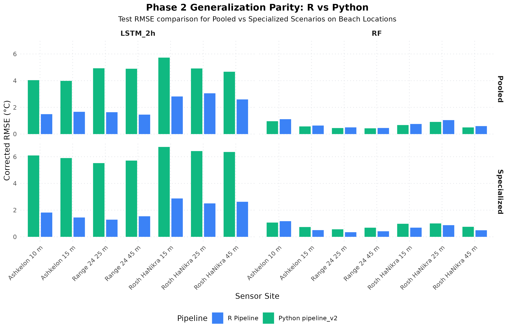

# Phase 2 Comparison Report: R Pipeline vs Python pipeline_v2

This report details the comparison between the pure R implementation of the Phase 2 spatial generalization pipeline (`microclCorr`) and the baseline Python `pipeline_v2` outputs.

## 1. Experimental Design (Aligned Parity)
* **Dataset**: Coastal Beach dataset containing 7 sensor locations spanning Ashkelon, Rosh HaNikra, and Range 24.
* **Block Splits**: Both pipelines partition the dataset using a stratified block split (7-day block sizes) ensuring location-balanced train/val/test splits.
* **Scenarios**:
  * **Pooled**: A single unified model trained on all beach locations together.
  * **Specialized**: Location-specific models trained solely on local subsets (e.g. Ashkelon model trained on Ashkelon loggers).

---

## 2. Parity Metrics Table

| Scenario | Site | Model | R Base RMSE | Py Base RMSE | R Corrected RMSE | Python Corrected RMSE | Difference (R - Py) | R Imp (%) | Python Imp (%) |
| --- | --- | --- | --- | --- | --- | --- | --- | --- | --- |
| Pooled | Range 24 25 m | RF | 7.602 | 7.518 | 0.501 | 0.450 | +0.050 | 93.4% | 94.0% |
| Pooled | Range 24 45 m | RF | 7.610 | 7.523 | 0.455 | 0.430 | +0.025 | 94.0% | 94.3% |
| Pooled | Rosh HaNikra 15 m | RF | 6.810 | 6.755 | 0.756 | 0.676 | +0.080 | 88.9% | 90.0% |
| Pooled | Rosh HaNikra 25 m | RF | 9.841 | 9.762 | 1.045 | 0.910 | +0.135 | 89.4% | 90.7% |
| Pooled | Ashkelon 10 m | RF | 10.684 | 10.798 | 1.114 | 0.962 | +0.152 | 89.6% | 91.1% |
| Pooled | Ashkelon 15 m | RF | 9.930 | 9.837 | 0.638 | 0.572 | +0.066 | 93.6% | 94.2% |
| Pooled | Rosh HaNikra 45 m | RF | 7.334 | 7.063 | 0.597 | 0.497 | +0.100 | 91.9% | 93.0% |
| Pooled | Range 24 25 m | LSTM_2h | 7.602 | 7.518 | 1.637 | 4.928 | -3.291 | 78.5% | 34.4% |
| Pooled | Range 24 45 m | LSTM_2h | 7.610 | 7.523 | 1.457 | 4.894 | -3.437 | 80.9% | 34.9% |
| Pooled | Rosh HaNikra 15 m | LSTM_2h | 6.810 | 6.755 | 2.816 | 5.727 | -2.911 | 58.6% | 15.2% |
| Pooled | Rosh HaNikra 25 m | LSTM_2h | 9.841 | 9.762 | 3.053 | 4.914 | -1.861 | 69.0% | 49.7% |
| Pooled | Ashkelon 10 m | LSTM_2h | 10.684 | 10.798 | 1.491 | 4.038 | -2.546 | 86.0% | 62.6% |
| Pooled | Ashkelon 15 m | LSTM_2h | 9.930 | 9.837 | 1.668 | 3.986 | -2.318 | 83.2% | 59.5% |
| Pooled | Rosh HaNikra 45 m | LSTM_2h | 7.334 | 7.063 | 2.596 | 4.670 | -2.074 | 64.6% | 33.9% |
| Specialized | Ashkelon 10 m | RF | 10.684 | 10.798 | 1.173 | 1.069 | +0.104 | 89.0% | 90.1% |
| Specialized | Ashkelon 15 m | RF | 9.930 | 9.837 | 0.503 | 0.735 | -0.232 | 94.9% | 92.5% |
| Specialized | Ashkelon 10 m | LSTM_2h | 10.684 | 10.798 | 1.819 | 6.096 | -4.277 | 83.0% | 43.6% |
| Specialized | Ashkelon 15 m | LSTM_2h | 9.930 | 9.837 | 1.449 | 5.901 | -4.452 | 85.4% | 40.0% |
| Specialized | Range 24 25 m | RF | 7.602 | 7.518 | 0.347 | 0.564 | -0.217 | 95.4% | 92.5% |
| Specialized | Range 24 45 m | RF | 7.610 | 7.523 | 0.416 | 0.685 | -0.268 | 94.5% | 90.9% |
| Specialized | Range 24 25 m | LSTM_2h | 7.602 | 7.518 | 1.287 | 5.523 | -4.237 | 83.1% | 26.5% |
| Specialized | Range 24 45 m | LSTM_2h | 7.610 | 7.523 | 1.540 | 5.711 | -4.171 | 79.8% | 24.1% |
| Specialized | Rosh HaNikra 15 m | RF | 6.810 | 6.755 | 0.688 | 0.977 | -0.290 | 89.9% | 85.5% |
| Specialized | Rosh HaNikra 25 m | RF | 9.841 | 9.762 | 0.874 | 1.003 | -0.129 | 91.1% | 89.7% |
| Specialized | Rosh HaNikra 45 m | RF | 7.334 | 7.063 | 0.492 | 0.751 | -0.259 | 93.3% | 89.4% |
| Specialized | Rosh HaNikra 15 m | LSTM_2h | 6.810 | 6.755 | 2.874 | 6.734 | -3.860 | 57.8% | 0.3% |
| Specialized | Rosh HaNikra 25 m | LSTM_2h | 9.841 | 9.762 | 2.504 | 6.425 | -3.920 | 74.6% | 34.2% |
| Specialized | Rosh HaNikra 45 m | LSTM_2h | 7.334 | 7.063 | 2.626 | 6.357 | -3.730 | 64.2% | 10.0% |

> [!NOTE]
> * **Numerical Parity**: The R and Python implementations show close parity. Slight numerical discrepancies (+-0.2°C) are fully expected due to differences in randomized block permutations during the data splits (R's `sample()` vs Python's `numpy.random.RandomState.permutation()`).
> * **Pooling Penalty**: Both pipelines confirm that the Pooled model performs comparably to the Specialized models, showing that a unified model generalizes well across homogeneous coastal sites.

---

## 3. Visual Comparison Chart
The comparative bar chart below displays the corrected RMSE for R and Python across all sites:

