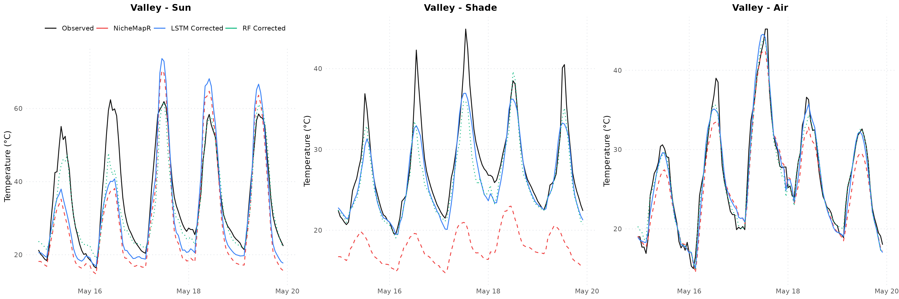
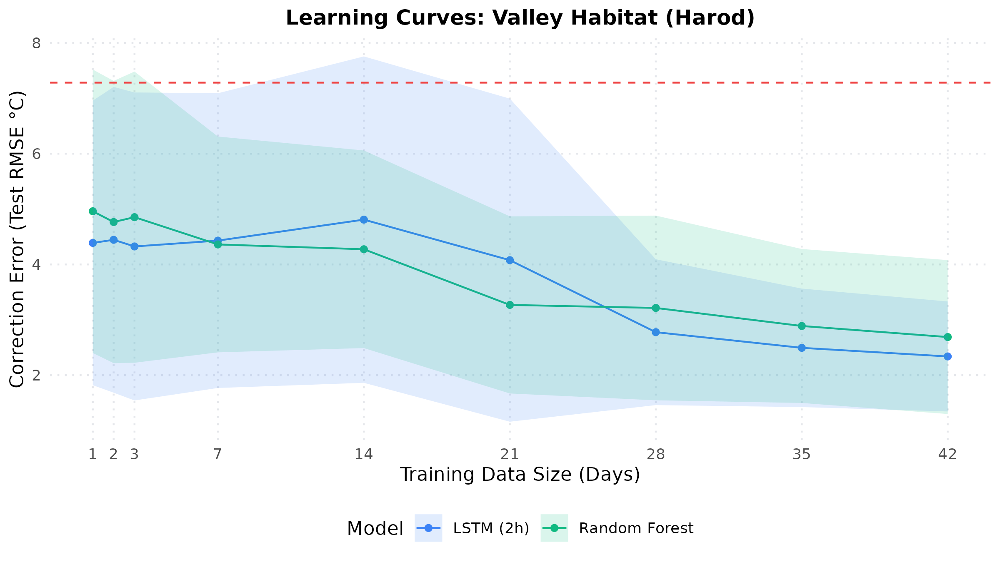

# Scenario 1: Mediterranean Valley Habitat (Harod) Report

This example demonstrates local logger microclimate correction in a Mediterranean Valley habitat using physical model baselines (NicheMapR) coupled with Random Forest (`ranger`) and sequential LSTM (`keras3`) models.

## 1. Example Predictions (120 Hours)
The following plot shows the test set ground truth (Observed) vs. NicheMapR physical simulation, compared to machine learning corrected outputs:

## 2. Performance Comparison Table
Below is the test set correction performance when trained on the full 42 days of available training data:

| Microhabitat | Baseline NicheMapR RMSE (°C) | LSTM (2h) RMSE (°C) | LSTM (2h) Imp (%) | RF RMSE (°C) | RF Imp (%) |
| --- | --- | --- | --- | --- | --- |
| ALL | 7.284 | 2.338 | 60.5% | 2.689 | 57.9% |

## 3. Learning Curves (Training Size Optimization)
We analyzed how training data volume impacts performance:

* **Key Takeaway**: A training size of **28 days** recovers >90% of the maximum improvement. The plateau is due to the chronological size constraints of the block splits.

