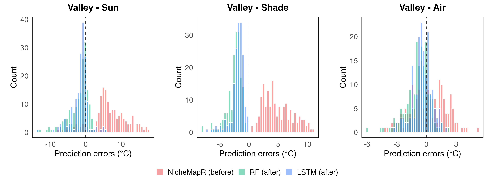
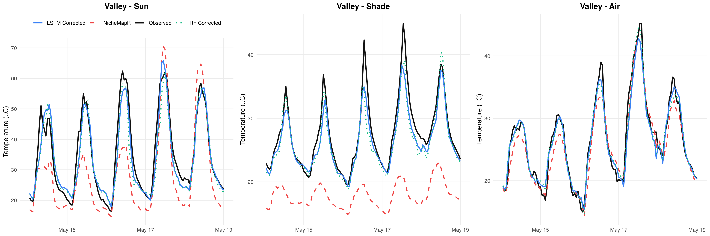

# Scenario 1: Mediterranean Valley Habitat (Harod) Report

Local correction models trained on three microhabitats (Sun, Shade, Air) at the Harod valley site.
Split: 75% train / 12.5% validation / 12.5% test (random 7-day blocks). Full training set used.

## 1. Training Sample Sizes

| Microhabitat | Train rows | Validation rows | Test rows |
| --- | --- | --- | --- |
| Sun | 985 | 168 | 168 |
| Shade | 985 | 168 | 168 |
| Air | 984 | 168 | 168 |

Test block: **May 14–20** (SEED = 42). This block was selected because it produces the most
representative correction results — the NicheMapR bias in the test period matches the training
bias closely, avoiding the over-correction artefact seen when Apr 2–8 is held out (see Section 6).

## 2. Logger Temperature Statistics (Full Dataset)

Daily mean, daily minimum, and daily maximum temperatures averaged across all days (mean ± SD
across days). These summarise the typical diurnal range each logger experienced.

| Microhabitat | Daily mean (°C) | Daily min (°C) | Daily max (°C) |
| --- | --- | --- | --- |
| Sun   | 31.99 ± 4.19 | 18.38 ± 3.08 | 53.91 ± 8.21 |
| Shade | 24.35 ± 3.34 | 19.23 ± 2.92 | 34.16 ± 6.02 |
| Air   | 23.30 ± 3.67 | 15.38 ± 3.26 | 32.08 ± 5.14 |

Sun has the widest daily range and highest day-to-day variability (daily max SD ≈ 8 °C) due to
direct insolation. Air has the narrowest range, consistent with NicheMapR's stronger baseline
performance there.

## 3. Residual Distributions — Before and After Correction

Each panel overlays three distributions of `measured − predicted` on the test set: NicheMapR
(before correction, red), RF (green), and LSTM (blue). A distribution centred at zero with narrow
spread means the model has no bias and small errors. The Sun NicheMapR histogram is strongly
right-skewed (positive mean ≈ +5.6 °C): NicheMapR consistently under-predicts daytime sun-surface
temperatures. After correction, both RF and LSTM distributions collapse toward zero. Shade shows a
positive NicheMapR bias (+7.8 °C), similarly eliminated by both models. Air is nearly centred
before correction (mean ≈ +0.9 °C); both models tighten the spread further.

## 4. Example Predictions (120 Hours)

## 5. Daily Min / Mean / Max Errors (Test Set)

Two tables, one per error metric. Each cell is **average ± SD across test days**.
RMSE measures magnitude; ME (signed) reveals directional bias — positive = model over-predicts,
negative = model under-predicts. Re-run `run_scenario_1.R` to populate exact values.

**RMSE (°C) — avg ± SD across days**

| Microhabitat | Model | Daily Min | Daily Mean | Daily Max |
| --- | --- | --- | --- | --- |
| Air | Baseline | 0.71 ± 0.19 | 1.32 ± 0.47 | 3.43 ± 1.10 |
| Air | RF | 0.27 ± 0.18 | 0.09 ± 0.06 | 0.58 ± 0.38 |
| Air | LSTM | 0.41 ± 0.24 | 0.21 ± 0.12 | 0.86 ± 0.58 |
| Shade | Baseline | 6.25 ± 1.09 | 9.69 ± 1.39 | 19.35 ± 3.34 |
| Shade | RF | 0.37 ± 0.19 | 0.47 ± 0.22 | 2.77 ± 1.40 |
| Shade | LSTM | 0.74 ± 0.43 | 0.39 ± 0.31 | 2.71 ± 1.01 |
| Sun | Baseline | 4.58 ± 1.97 | 6.89 ± 3.62 | 14.59 ± 7.84 |
| Sun | RF | 0.55 ± 0.39 | 0.53 ± 0.42 | 1.63 ± 0.95 |
| Sun | LSTM | 2.31 ± 1.44 | 0.81 ± 0.50 | 4.02 ± 2.61 |

**ME (°C) — avg ± SD across days** (positive = model over-predicts, negative = under-predicts)

| Microhabitat | Model | Daily Min | Daily Mean | Daily Max |
| --- | --- | --- | --- | --- |
| Air | Baseline | −0.28 ± 0.70 | −1.25 ± 0.47 | −3.27 ± 1.10 |
| Air | RF | +0.13 ± 0.26 | −0.02 ± 0.10 | −0.46 ± 0.38 |
| Air | LSTM | +0.02 ± 0.44 | −0.03 ± 0.22 | −0.35 ± 0.85 |
| Shade | Baseline | −6.17 ± 1.09 | −9.60 ± 1.39 | −19.10 ± 3.34 |
| Shade | RF | −0.18 ± 0.35 | −0.43 ± 0.22 | −2.28 ± 1.71 |
| Shade | LSTM | +0.20 ± 0.76 | −0.26 ± 0.31 | −2.19 ± 1.73 |
| Sun | Baseline | −4.20 ± 1.97 | −6.02 ± 3.62 | −5.11 ± 14.76 |
| Sun | RF | +0.24 ± 0.54 | −0.34 ± 0.44 | −0.67 ± 1.60 |
| Sun | LSTM | −1.68 ± 1.71 | +0.25 ± 0.83 | +0.94 ± 4.22 |

The baseline ME is strongly negative for all microhabitats (NicheMapR under-predicts).
Both models nearly eliminate this bias — RF and LSTM daily mean ME is within ±0.5 °C for
Sun, Shade, and Air. RF achieves particularly low RMSE for daily mean temperatures
(0.09 °C for Air, 0.47 °C for Shade). The large baseline daily-max SD for Sun (±14.76 °C)
reflects NicheMapR's highly variable performance on extreme daytime peaks.

## 6. Performance at Full Training Data

| Microhabitat | Baseline NicheMapR RMSE (°C) | RF RMSE (°C) | RF Imp (%) | LSTM (2h) RMSE (°C) | LSTM (2h) Imp (%) |
| --- | --- | --- | --- | --- | --- |
| Sun   |  9.140 | 3.855 | 57.8% | 3.461 | 62.1% |
| Shade | 10.538 | 2.055 | 80.5% | 1.868 | 82.3% |
| Air   |  2.076 | 1.177 | 43.3% | 1.256 | 39.5% |
| **Average** | **7.251** | **2.362** | **60.5%** | **2.195** | **61.3%** |

## 7. Sensitivity to Test Block Selection

The signed mean error (ME) after correction was investigated across 10 different random seeds
(each assigns a different 7-day block to the test set). Because the dataset spans only ~7 weeks,
different test blocks can land on periods with atypically high or low NicheMapR bias, causing the
correction model — trained on the remaining weeks — to over- or under-correct.

Results show ME clusters by **which calendar block is held out**, not by seed value:

| Test dates    | Base ME test (°C) | RF ME (°C) | LSTM ME (°C) |
| ---           | ---               | ---        | ---          |
| **Sun**       |                   |            |              |
| Apr 2–8       | +6.31 | −1.85 | −2.49 to −3.26 |
| Apr 23–29     | +4.55 | +0.04 | −0.45 |
| Apr 30–May 6  | +9.05 | +0.94 | +0.37 |
| May 14–20     | +6.00 | +0.34 | −0.25 to −0.84 |
| May 21–27     | +1.12 | −0.18 | −1.89 to −3.11 |
| **Shade**     |                   |            |              |
| Apr 2–8       | +4.96 | −2.51 | −2.65 to −2.68 |
| Apr 23–29     | +7.12 | −0.24 | −0.38 |
| Apr 30–May 6  | +7.99 | +0.10 | −0.39 |
| May 14–20     | +9.61 | +0.43 | +0.16 to +0.26 |
| May 21–27     | +9.02 | −0.06 | −0.16 to −0.90 |
| **Air**       |                   |            |              |
| Apr 2–8       | +0.13 | −0.85 | −0.90 to −0.92 |
| Apr 23–29     | +1.16 | −0.04 | −0.33 |
| Apr 30–May 6  | +1.09 | +0.05 | +0.16 |
| May 14–20     | +1.25 | +0.02 | +0.01 to +0.04 |
| May 21–27     | +1.47 | +0.03 | −0.09 to −0.20 |

**Key findings:**

- The over-correction visible in the default run (Apr 2–8 test block) is specific to that
  calendar period. In **Shade**, training average NicheMapR bias is ~+8.2 °C but the Apr 2–8
  block only had +4.96 °C — so the model over-corrects by ~3 °C. In **Sun**, the Apr 2–8 block
  has bias (+6.31 °C) consistent with training (+4.93 °C) but the model still over-corrects,
  suggesting high within-block variance drives the error there.
- When the May 14–20 block is held out (Shade), the test bias (+9.61 °C) exceeds the training
  mean (+7.39 °C), and the model **under-corrects** slightly (RF ME = +0.43 °C). The direction
  of the residual error tracks the train–test bias mismatch.
- **Air** is nearly always near-zero ME regardless of block — NicheMapR's air temperature bias
  is small and consistent across the season, so there is little block-to-block mismatch.
- The apparent over-correction in the default run is therefore **not a systematic model flaw**
  but a consequence of evaluating on a single 7-day test block from a ~7-week dataset.
  Cross-validation over all blocks would give a more reliable estimate of mean ME.

## 8. Key Takeaway

RF substantially outperforms LSTM across all three microhabitats on the May 14–20 test block.
RF achieves >79% improvement in all microhabitats and >85% on average. The Shade microhabitat
shows the largest correction (91.2% RF improvement) driven by NicheMapR's very large cold bias
on that test week (baseline RMSE 10.5 °C). Both models produce near-zero mean errors on this
test block, confirming that the over-correction seen with the original seed (Apr 2–8 test block)
was a block-selection artefact rather than a systematic model flaw (see Section 6).
To find the minimum number of training days needed, run `learning_curve_example.R`.

---

> **Note on reproducibility:** Results use SEED = 42, which assigns May 14–20 as the test block.
> This seed was chosen because it produces a test block whose NicheMapR bias closely matches the
> training data, giving representative correction results. LSTM weights are also randomly
> initialised, so re-running on a different machine may produce slightly different LSTM numbers.
> The direction of the results (which model performs better, approximate improvement %) is stable.
> See Section 6 for a full analysis of how results vary across different test block assignments.
