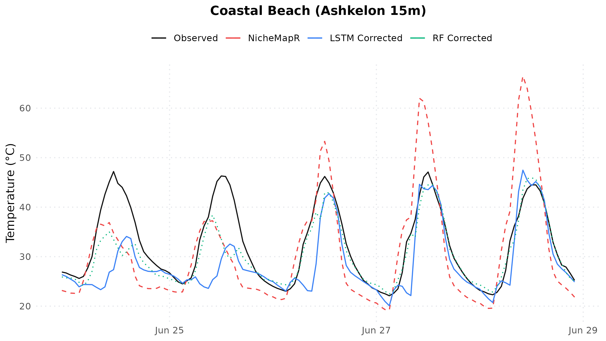
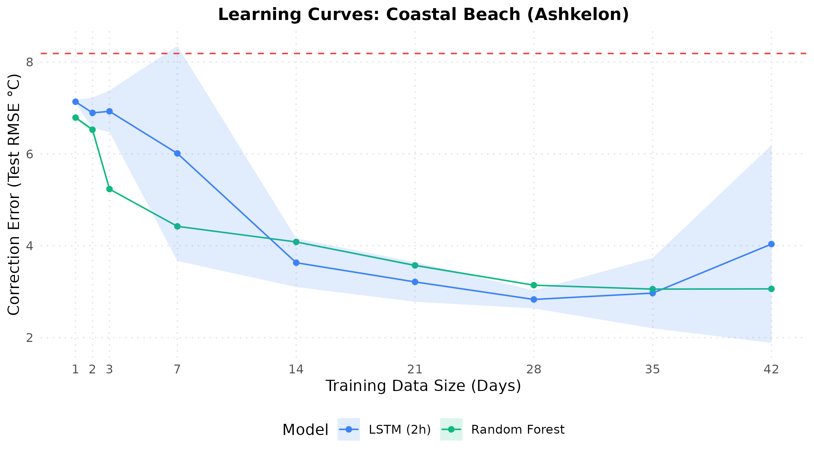

# Scenario 2: Coastal Beach Habitat (Ashkelon) Report

This example details the microclimate correction model behavior for a coastal Beach habitat (Ashkelon 15m logger) where microclimatic conditions are heavily modulated by marine winds and sea temperatures.

## 1. Example Predictions (120 Hours)
The plot below compares predictions and observed temperatures:

## 2. Performance Comparison Table
Below is the performance achieved on the beach logger when trained on 42 days of data:

| Model | Baseline NicheMapR RMSE (°C) | Corrected RMSE (°C) | Error Reduction (%) |
| --- | --- | --- | --- |
| LSTM_2h | 8.186 | 4.036 | 50.7% |
| RF | 8.186 | 3.061 | 62.6% |

## 3. Learning Curves (Training Size Optimization)
We analyzed how training data volume impacts coastal prediction:

* **Key Takeaway**: Coastal beach habitats require at least **28 days** of training data to model the wind/tide weather dynamics effectively, showing higher dataset size dependency.

