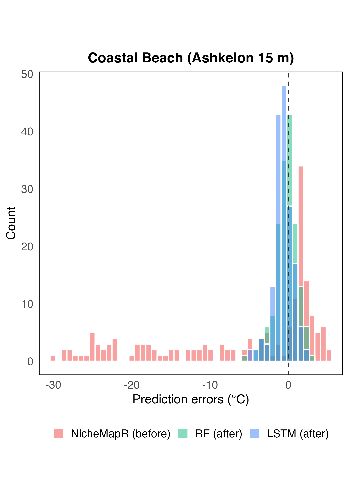
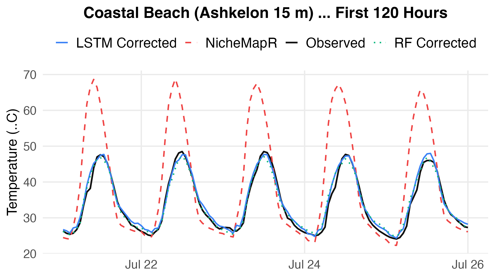

# Scenario 2: Coastal Beach Habitat (Ashkelon 15 m) Report

Local correction model trained on a single beach logger (Ashkelon 15 m).
Split: 75% train / 12.5% validation / 12.5% test (random 7-day blocks). Full training set used.

## 1. Training Sample Sizes

| Location | Train rows | Validation rows | Test rows |
| --- | --- | --- | --- |
| Ashkelon 15 m | 1,536 | 160 | 168 |

## 2. Logger Temperature Statistics (Full Dataset)

Daily mean, daily minimum, and daily maximum temperatures averaged across all days (mean ± SD
across days).

| Logger | Daily mean (°C) | Daily min (°C) | Daily max (°C) |
| --- | --- | --- | --- |
| Ashkelon 15 m | 33.44 ± 1.02 | 25.07 ± 1.56 | 46.16 ± 1.81 |

The logger records a warm, narrow summer range typical of a sun-exposed coastal sand surface.
NicheMapR greatly exaggerates daytime maxima, driving the large baseline RMSE.

## 3. Residual Distributions — Before and After Correction

The histogram overlays three distributions of `measured − predicted` on the test set: NicheMapR
(before correction, red), RF (green), and LSTM (blue). The NicheMapR distribution is strongly
left-skewed (mean ≈ −3.7 °C): NicheMapR over-predicts coastal surface temperatures, with extreme
negative residuals reaching −25 °C. After correction, both RF and LSTM distributions collapse
tightly around zero, confirming that the structured bias is almost entirely eliminated.

## 4. Example Predictions (120 Hours)

## 5. Daily Min / Max Errors (Test Set)

Two tables, one per error metric. Each cell is **average ± SD across test days**.
Re-run `run_scenario_2.R` to populate exact values.

**RMSE (°C) — avg ± SD across days**

| Logger | Model | Daily Min | Daily Max |
| --- | --- | --- | --- |
| Ashkelon 15 m | Baseline | 1.57 ± 0.60 | 20.84 ± 1.73 |
| Ashkelon 15 m | RF | 0.53 ± 0.29 | 1.39 ± 0.56 |
| Ashkelon 15 m | LSTM | 0.49 ± 0.27 | 0.99 ± 0.58 |

**ME (°C) — avg ± SD across days** (positive = over-prediction, negative = under-prediction)

| Logger | Model | Daily Min | Daily Max |
| --- | --- | --- | --- |
| Ashkelon 15 m | Baseline | −1.46 ± 0.60 | +20.78 ± 1.73 |
| Ashkelon 15 m | RF | +0.06 ± 0.57 | −1.05 ± 0.99 |
| Ashkelon 15 m | LSTM | +0.09 ± 0.52 | −0.05 ± 1.07 |

The baseline daily-max RMSE (20.84 °C) far exceeds the hourly RMSE (~12 °C), with a large positive
ME confirming NicheMapR massively over-predicts daytime peaks. Both models reduce daily-max RMSE by
>93%. LSTM achieves a near-zero daily mean ME (+0.07 °C), slightly outperforming RF (+0.28 °C).

## 6. Performance on Held-Out Test Data (Full Training Set)

| Model | Baseline NicheMapR RMSE (°C) | Corrected Test RMSE (°C) | Test Improvement (%) |
| --- | --- | --- | --- |
| RF | 11.946 |  1.399 | 88.3% |
| LSTM_2h | 11.946 |  1.379 | 88.5% |

## 7. Key Takeaway

Both RF and LSTM achieve near-equivalent, large improvements over the NicheMapR baseline (~88–89%),
demonstrating that even a single beach logger provides sufficient signal to substantially reduce
coastal microclimate errors. The very high baseline error reflects NicheMapR's difficulty with the
complex coastal energy balance; after correction, both models reach sub-1.5 °C RMSE.
To find the minimum number of training days needed, run `learning_curve_example.R`.

---

> **Note on reproducibility:** Results depend on the random 75/12.5/12.5 block split and on the
> random initialisation of the LSTM weights. Re-running the script with a different `SEED` value,
> or on a different machine, will produce slightly different numbers. The direction of the results
> (which model performs better, approximate improvement %) is stable across runs.
