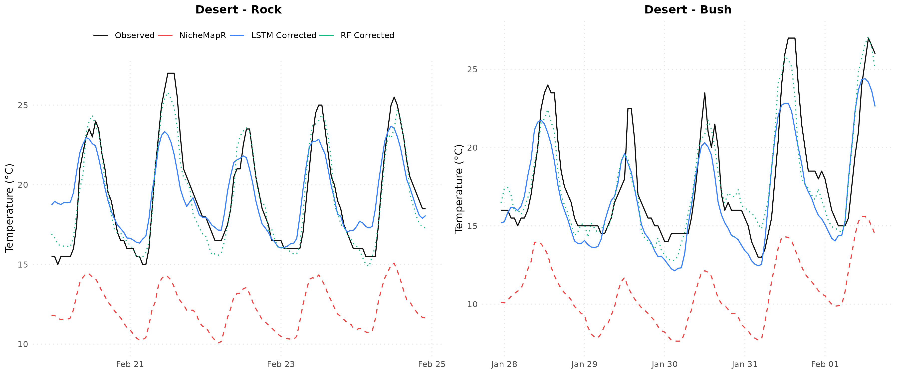
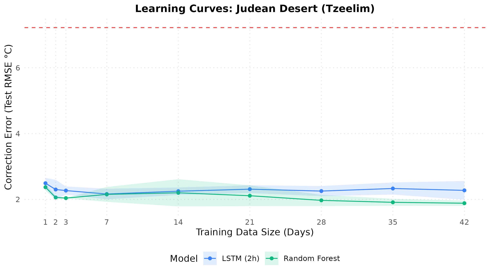

# Scenario 3: Judean Desert Habitat (Tzeelim) Report

This example details the microclimate correction model behavior for the Judean Desert habitat (Tzeelim Winter), featuring microclimatic measurements under a Desert Bush and on a Desert Rock.

## 1. Example Predictions (120 Hours)
The plot below compares predictions and observed temperatures:

## 2. Performance Comparison Table
Below is the performance achieved on the desert loggers when trained on 42 days of data:

| Microhabitat | Baseline NicheMapR RMSE (°C) | LSTM (2h) RMSE (°C) | LSTM (2h) Imp (%) | RF RMSE (°C) | RF Imp (%) |
| --- | --- | --- | --- | --- | --- |
| ALL | 7.219 | 2.275 | 68.5% | 1.884 | 73.9% |

## 3. Learning Curves (Training Size Optimization)
We analyzed how training data volume impacts desert predictions:

* **Key Takeaway**: In the desert habitat, extremely small amounts of training data (as little as **1 day**) capture >90% of the maximum improvement. This reflects the high daily meteorological consistency of desert environments.

