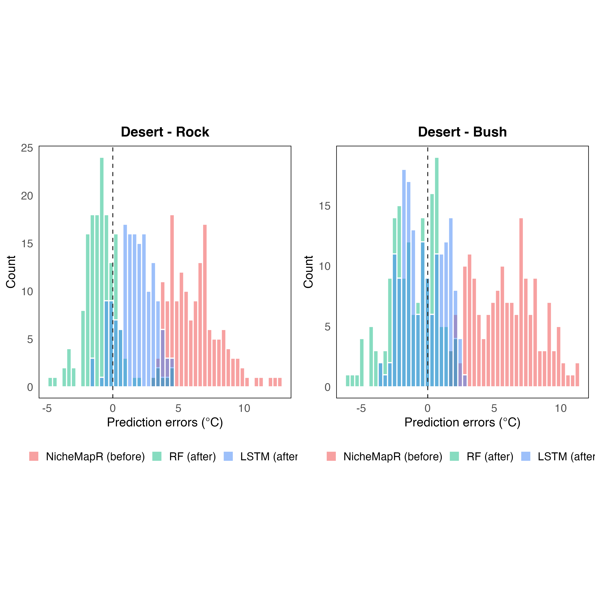
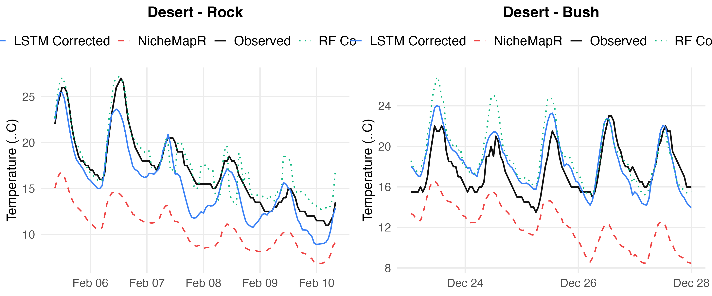

# Scenario 3: Judean Desert Habitat (Tzeelim) Report

Local correction models trained on two microhabitats (Rock, Bush) at the Tzeelim desert site.
Only the **Small** object size was used for training and evaluation in this scenario (one Rock
logger and one Bush logger). Medium and Large objects are included in Table 1 for context but
no correction models were trained on them here.
Split: 75% train / 12.5% validation / 12.5% test (random 7-day blocks). Full training set used.

## 1. Training Sample Sizes

| Microhabitat | Train rows | Validation rows | Test rows |
| --- | --- | --- | --- |
| Rock (Rock_S_T_2_W) | 344 | 94 | 160 |
| Bush (Bush_S_T_2_W) | 1,757 | 168 | 168 |

## 2. Logger Temperature Statistics (Full Dataset)

Daily mean, daily minimum, and daily maximum temperatures averaged across all days (mean ± SD
across days).

| Microhabitat | Size   | n hours | Daily mean (°C) | Daily min (°C) | Daily max (°C) |
| ---          | ---    | ---     | ---             | ---            | ---            |
| Rock         | Small  | 598     | 18.66 ± 2.38    | 15.06 ± 1.76   | 23.62 ± 3.80   |
| Rock         | Medium | 2093    | 19.55 ± 2.01    | 17.05 ± 1.88   | 22.03 ± 2.36   |
| Rock         | Large  | 2776    | 18.57 ± 2.32    | 16.74 ± 2.22   | 20.40 ± 2.58   |
| Bush         | Small  | 2093    | 18.90 ± 2.42    | 15.29 ± 2.08   | 24.99 ± 3.58   |
| Bush         | Medium | 2093    | 18.75 ± 2.29    | 15.95 ± 2.10   | 22.64 ± 2.98   |
| Bush         | Large  | 2093    | 18.84 ± 2.21    | 15.20 ± 1.98   | 24.46 ± 3.10   |

All loggers record similar daily means (~19 °C). Larger rock objects show a compressed daily
range (lower max, higher min), reflecting greater thermal mass. Bush daily max is consistently
higher than rock objects of similar size, due to greater radiative exposure above the canopy.
NicheMapR systematically under-predicts by ~6 °C — a consistent cold bias that both models
correct effectively (~71% improvement) for the Small size used in training.

## 3. Residual Distributions — Before and After Correction

Each panel overlays three distributions of `measured − predicted` on the test set: NicheMapR
(before correction, red), RF (green), and LSTM (blue). Both desert loggers show a strong positive
NicheMapR bias: Rock mean residual ≈ +6.7 °C, Bush ≈ +6.5 °C. The distributions are fairly
symmetric around their positive mean — a pure cold bias rather than a skewed tail. After correction,
both RF and LSTM distributions are centred at zero, confirming the bias is a consistent, learnable
offset that both models eliminate effectively.

## 4. Example Predictions (120 Hours)

## 5. Daily Min / Mean / Max Errors (Test Set)

Two tables, one per error metric. Each cell is **average ± SD across test days**.
Models were trained and evaluated on **Small** objects only.

**RMSE (°C) — avg ± SD across days**

| Microhabitat | Size | Model | Daily Min | Daily Mean | Daily Max |
| --- | --- | --- | --- | --- | --- |
| Bush | Small | Baseline | 5.06 ± 1.96 | 6.16 ± 2.01 | 8.33 ± 2.14 |
| Bush | Small | RF | 1.51 ± 0.94 | 1.83 ± 1.25 | 2.72 ± 1.95 |
| Bush | Small | LSTM | 1.44 ± 0.67 | 1.34 ± 0.63 | 1.30 ± 0.89 |
| Rock | Small | Baseline | 5.40 ± 0.99 | 6.45 ± 1.40 | 8.49 ± 2.43 |
| Rock | Small | RF | 0.88 ± 0.55 | 1.06 ± 0.77 | 1.71 ± 1.26 |
| Rock | Small | LSTM | 2.38 ± 0.95 | 1.79 ± 0.64 | 2.27 ± 1.41 |

**ME (°C) — avg ± SD across days** (positive = over-prediction, negative = under-prediction)

| Microhabitat | Size | Model | Daily Min | Daily Mean | Daily Max |
| --- | --- | --- | --- | --- | --- |
| Bush | Small | Baseline | −4.72 ± 1.96 | −5.88 ± 2.01 | −8.10 ± 2.14 |
| Bush | Small | RF | +0.96 ± 1.25 | +1.13 ± 1.56 | +1.62 ± 2.36 |
| Bush | Small | LSTM | +0.36 ± 1.51 | +0.33 ± 1.40 | +0.42 ± 1.33 |
| Rock | Small | Baseline | −5.32 ± 0.99 | −6.31 ± 1.40 | −8.19 ± 2.43 |
| Rock | Small | RF | +0.30 ± 0.90 | +0.75 ± 0.81 | +1.03 ± 1.48 |
| Rock | Small | LSTM | −2.21 ± 0.95 | −1.68 ± 0.64 | −1.57 ± 1.77 |

The baseline ME is strongly negative for both microhabitats (~−6 °C), confirming NicheMapR's
consistent cold bias. RF eliminates the bias for Rock (ME ~+0.75 °C) but slightly over-corrects.
For Bush, LSTM achieves a near-zero ME (+0.33 °C) and lower RMSE than RF, while RF over-corrects
more (+1.13 °C). Both models reduce daily extremes RMSE by ~68–83%.

## 6. Performance at Full Training Data

| Microhabitat | Baseline NicheMapR RMSE (°C) | RF RMSE (°C) | RF Imp (%) | LSTM (2h) RMSE (°C) | LSTM (2h) Imp (%) |
| --- | --- | --- | --- | --- | --- |
| Rock  | 6.536 | 1.657 | 74.6% | 2.178 | 66.7% |
| Bush  | 6.344 | 2.090 | 67.1% | 1.591 | 74.9% |
| **Average** | **6.440** | **1.873** | **70.9%** | **1.885** | **70.8%** |

## 7. Key Takeaway

RF and LSTM perform comparably on average (~71% improvement each), with RF leading on Rock and LSTM
leading on Bush. The NicheMapR baseline error is large (~6.4 °C) due to the complex rock and bush
surface energy balance; both models correct it substantially.
To find the minimum number of training days needed, run `learning_curve_example.R`.

---

> **Note on reproducibility:** Results depend on the random 75/12.5/12.5 block split and on the
> random initialisation of the LSTM weights. Re-running the script with a different `SEED` value,
> or on a different machine, will produce slightly different numbers. The direction of the results
> (which model performs better, approximate improvement %) is stable across runs.
