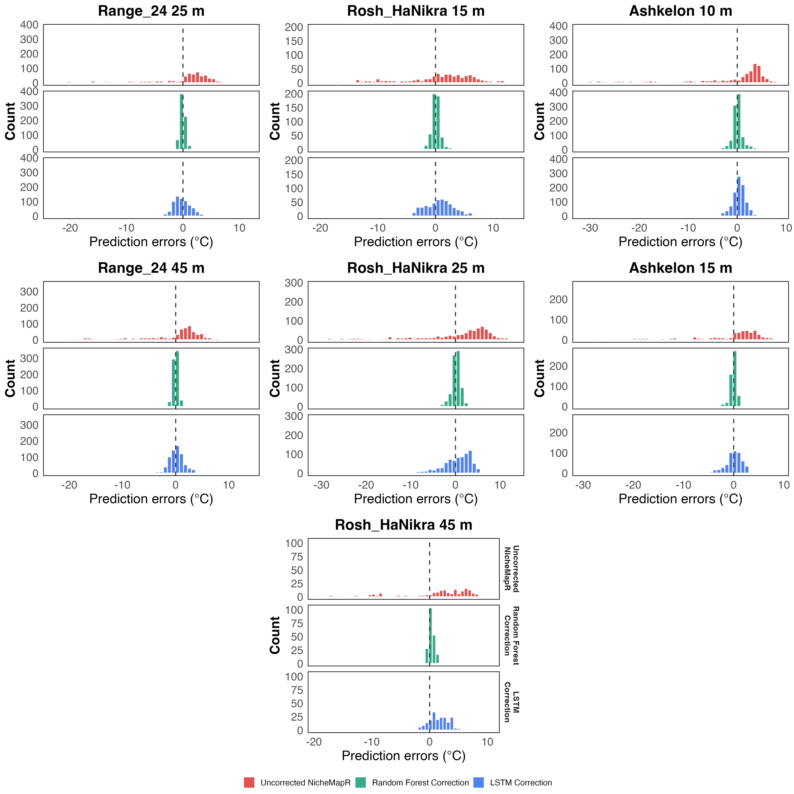
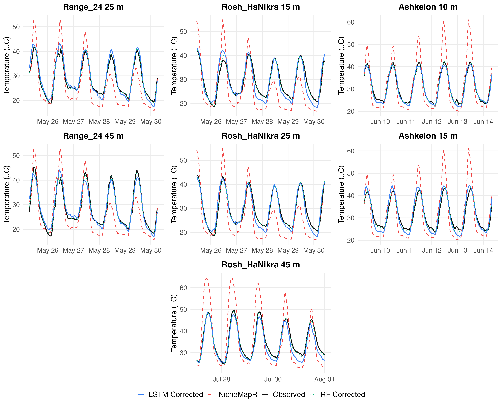

# Scenario 4: Beach Habitat — Pooled Spatial Generalization

A single unified model is trained on all 7 beach logger sites combined and evaluated on each
individual site.

**Comparison baseline — Scenario 2 (single logger):** RF RMSE = 3.06 °C, improvement = 62.6%,
trained on ~1,405 rows (Ashkelon 15 m only).
The pooled model uses ~10× more training data, so performance gains cannot be attributed
solely to spatial diversity (see Scenario 8 for a controlled comparison).

## 1. Training Sample Sizes

| Split | Rows |
| --- | --- |
| Train | 13,988 |
| Validation | 4,210 |
| Test | 4,487 |

## 2. Residual Distributions — Before and After Correction (RF)

Each panel overlays two distributions of `measured − predicted` per site: NicheMapR (before
correction, red) and RF (green), and LSTM (blue). The NicheMapR
distribution across all 7 beach loggers is strongly left-skewed (mean ≈ −3.7 °C): NicheMapR
over-predicts coastal surface temperatures, with extreme daytime over-predictions. After RF
correction the distribution collapses to near zero at every site.

## 3. Example Predictions (120 Hours)

## 4. Daily Min / Max Errors (Test Set, averaged across 7 sites)

Two tables, one per error metric. Each cell is **average ± SD across test days**, then averaged
across the 7 sites.

**RMSE (°C) — avg ± SD across days**

| Model | Daily Min | Daily Max |
| --- | --- | --- |
| Baseline | 3.04 ± 1.67 | 15.04 ± 5.79 |
| RF | 0.50 ± 0.34 | 0.90 ± 0.60 |
| LSTM | 1.57 ± 0.88 | 2.69 ± 1.54 |

**ME (°C) — avg ± SD across days** (positive = over-prediction, negative = under-prediction)

| Model | Daily Min | Daily Max |
| --- | --- | --- |
| Baseline | −2.44 ± 1.81 | +12.38 ± 8.26 |
| RF | −0.01 ± 0.46 | +0.90 ± 0.60 |
| LSTM | −0.56 ± 1.42 | +2.69 ± 1.54 |

The pooled RF model achieves outstanding daily-max correction (0.90 vs 15.04 °C baseline, 94%
reduction) with near-zero ME, far better than the single-logger model in Scenario 2.
LSTM performs substantially worse than RF here, suggesting the pooled LSTM did not generalise
as well across the 7 beach sites.

## 5. Aggregated Hourly Summary

| Model | Avg Base RMSE (°C) | Avg Corrected Test RMSE (°C) | Avg Test Improvement (%) |
| --- | --- | --- | --- |
| RF |  8.544 |  0.733 | 91.5% |
| LSTM_2h |  8.544 |  2.134 | 74.0% |

## 6. Per-Site Results

| Site | Model | Base Test RMSE (°C) | Corrected Test RMSE (°C) | Test Improvement (%) |
| --- | --- | --- | --- | --- |
| Range_24 25 m | RF |  7.602 |  0.505 | 93.4% |
| Range_24 25 m | LSTM_2h |  7.602 |  1.622 | 78.7% |
| Range_24 45 m | RF |  7.610 |  0.461 | 93.9% |
| Range_24 45 m | LSTM_2h |  7.610 |  1.479 | 80.6% |
| Rosh_HaNikra 15 m | RF |  6.810 |  0.765 | 88.8% |
| Rosh_HaNikra 15 m | LSTM_2h |  6.810 |  2.852 | 58.1% |
| Rosh_HaNikra 25 m | RF |  9.841 |  1.041 | 89.4% |
| Rosh_HaNikra 25 m | LSTM_2h |  9.841 |  3.111 | 68.4% |
| Ashkelon 10 m | RF | 10.684 |  1.112 | 89.6% |
| Ashkelon 10 m | LSTM_2h | 10.684 |  1.472 | 86.2% |
| Ashkelon 15 m | RF |  9.930 |  0.638 | 93.6% |
| Ashkelon 15 m | LSTM_2h |  9.930 |  1.640 | 83.5% |
| Rosh_HaNikra 45 m | RF |  7.334 |  0.609 | 91.7% |
| Rosh_HaNikra 45 m | LSTM_2h |  7.334 |  2.759 | 62.4% |

## 7. Key Takeaway

The pooled RF model (avg 0.734 °C RMSE, 91.5% improvement) substantially outperforms the single-logger
baseline from Scenario 2 (1.399 °C RMSE, 88.3%), but has ~10× more training data, so the comparison is
not volume-controlled. Performance is virtually identical to the specialized per-location models
in Scenario 5 (0.733 °C avg), confirming that a single pooled model generalizes as well as
separate location-specific models. Daily-max RMSE (0.90 °C pooled vs 1.39 °C single-logger)
shows the pooled model's particular strength at capturing extreme temperature events.
