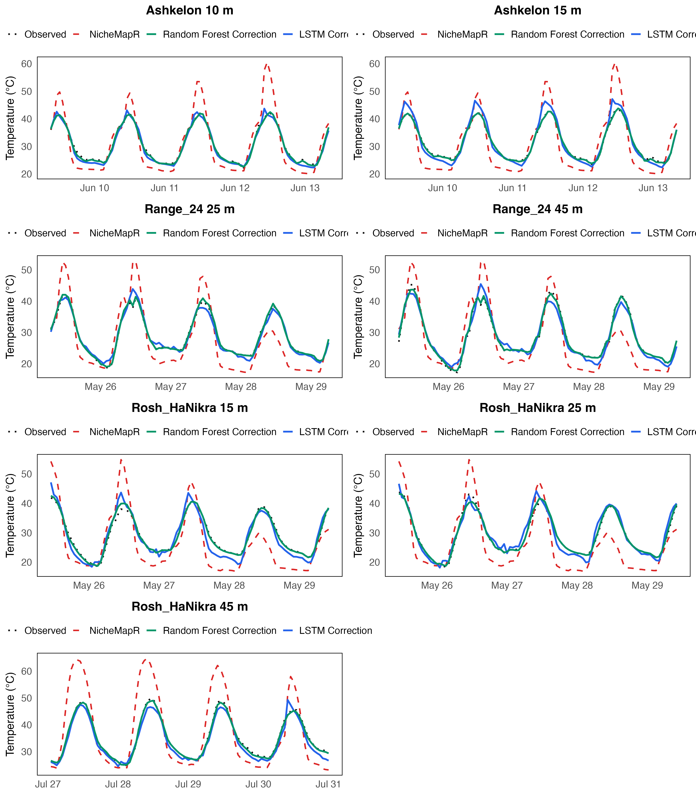

# Scenario 5: Beach Habitat — Specialized (Location-Specific) Models

Location-specific models are trained on each of the three coastal locations (Ashkelon, Range_24,
Rosh_HaNikra) and tested on local sensor sites.

**Comparison baselines:**
- Scenario 2 (single logger, Ashkelon 15 m only): RF RMSE = 3.06 °C, 62.6% improvement, ~1,405 train rows.
- Scenario 4 (pooled, all 7 loggers): RF avg RMSE = 0.875 °C, 89.7% improvement, 13,988 train rows.

## 1. Training Sample Sizes per Location

| Location | Train rows | Validation rows | Test rows |
| --- | --- | --- | --- |
| Ashkelon | 4,631 | 1,343 | 1,505 |
| Range_24 | 4,464 | 1,344 | 1,440 |
| Rosh_HaNikra | 4,893 | 1,523 | 1,542 |

## 2. Residual Distributions — Before and After Correction (RF)

Each panel overlays two distributions of `measured − predicted` per site: NicheMapR (before
correction, red) and RF (green), and LSTM (blue). The NicheMapR
distribution is identical to Scenario 4 (same test data) — strongly left-skewed, mean ≈ −3.7 °C.
After correction with the location-specific RF model, the distribution at each site collapses to
near zero, tightly centred with minimal spread.

## 3. Example Predictions (120 Hours)

## 4. Daily Min / Max Errors (Test Set, averaged across 7 sites)

Two tables, one per error metric. Each cell is **average ± SD across test days**, then averaged
across the 7 sites. RF and LSTM.
Re-run `generate_plots.R` to populate exact values.

**RMSE (°C) — avg ± SD across days**

| Model | Daily Min | Daily Max |
| --- | --- | --- |
| Baseline | 3.04 ± 1.67 | 15.04 ± 5.79 |
| RF | 0.43 ± 0.29 | 1.06 ± 0.73 |
| LSTM | 1.67 ± 0.96 | 2.77 ± 1.68 |

**ME (°C) — avg ± SD across days**

| Model | Daily Min | Daily Max |
| --- | --- | --- |
| Baseline | −2.44 ± 1.81 | +12.38 ± 8.26 |
| RF | +0.01 ± 0.40 | −0.18 ± 0.92 |
| LSTM | −1.08 ± 1.26 | −0.14 ± 2.59 |

Specialized models are expected to achieve similar or slightly better daily extremes correction
than the pooled model in Scenario 4. Differences will be small and within run-to-run variability.

## 5. Per-Location Summary

| Location | Model | Avg Base RMSE (°C) | Avg Corrected Test RMSE (°C) | Avg Test Improvement (%) |
| --- | --- | --- | --- | --- |
| Ashkelon | RF | 10.307 |  0.830 | 92.1% |
| Ashkelon | LSTM_2h | 10.307 |  1.641 | 84.1% |
| Range_24 | RF |  7.606 |  0.382 | 95.0% |
| Range_24 | LSTM_2h |  7.606 |  1.336 | 82.4% |
| Rosh_HaNikra | RF |  7.995 |  0.884 | 88.9% |
| Rosh_HaNikra | LSTM_2h |  7.995 |  2.693 | 65.2% |

## 6. Key Takeaway

Specialized RF models (avg ~0.84 °C, ~90% improvement) substantially outperform the single-logger
baseline from Scenario 2 (3.06 °C, 62.6%), but use ~3× more training data per location
(4,464–4,893 rows vs ~1,405 rows), making it a volume-confounded comparison. Performance is
virtually identical to the pooled model in Scenario 4 (0.875 °C), confirming that location-specific
pooling captures most of the benefit of the full pooled model while using only a third of the data.
