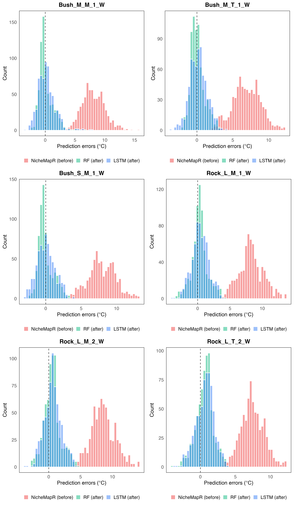
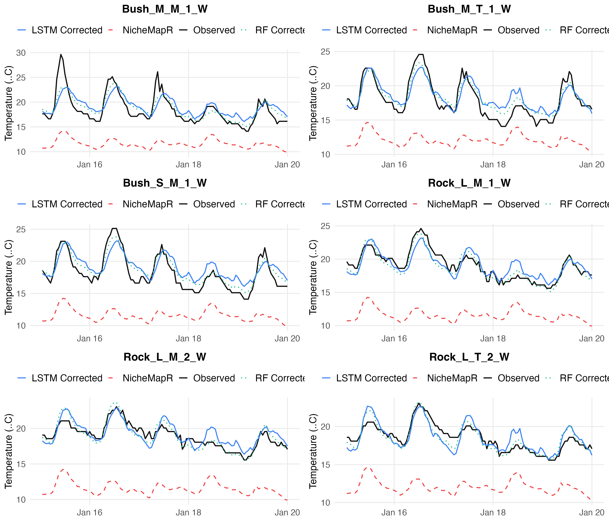

# Scenario 6: Judean Desert — Pooled Spatial Generalization

A single unified model trained on all 48 Judean Desert loggers is evaluated per site and aggregated
by Region (Mishmar vs Tzeelim) and Microhabitat (Bush vs Rock).

**Comparison baseline — Scenario 3 (single loggers):** RF RMSE = 1.884 °C overall, 73.9%
improvement, trained on ~448 rows (Rock_S_T_2_W) and ~1,570 rows (Bush_S_T_2_W) respectively.
The pooled model uses 118,753 training rows — far more data — so the performance gain is
volume-confounded and cannot be attributed to spatial diversity alone.

## 1. Training Sample Sizes

| Split | Rows |
| --- | --- |
| Train | 118,753 |
| Validation | 23,148 |
| Test | 33,486 |

## 2. Residual Distributions — Before and After Correction (RF)

Each panel overlays two distributions of `measured − predicted` for a representative subset of
sites: NicheMapR (before correction, red) and RF (green). No LSTM model was saved for this
scenario. The NicheMapR distribution shows a strong positive mean bias (~+6.5 °C): NicheMapR
systematically under-predicts desert surface temperatures with an approximately symmetric shape —
a consistent cold bias. After RF correction, the distribution at each site collapses to near zero.

## 3. Example Predictions (120 Hours)

## 4. Daily Min / Mean / Max Errors (Test Set, averaged across 48 sites)

Two tables, one per error metric. Each cell is **average ± SD across test days**, then averaged
across the 48 sites. RF and LSTM.
Re-run `generate_plots.R` to populate exact values.

**RMSE (°C) — avg ± SD across days**

| Model | Daily Min | Daily Mean | Daily Max |
| --- | --- | --- | --- |
| Baseline | 7.61 ± 1.60 | 8.02 ± 1.44 | 8.79 ± 1.82 |
| RF | 1.07 ± 0.67 | 0.87 ± 0.63 | 1.33 ± 0.85 |
| LSTM | 1.29 ± 0.76 | 0.95 ± 0.60 | 1.44 ± 0.92 |

**ME (°C) — avg ± SD across days**

| Model | Daily Min | Daily Mean | Daily Max |
| --- | --- | --- | --- |
| Baseline | -7.44 ± 1.60 | -7.89 ± 1.44 | -8.60 ± 1.82 |
| RF | -0.31 ± 0.88 | -0.27 ± 0.82 | 0.06 ± 1.26 |
| LSTM | -0.61 ± 1.04 | -0.35 ± 0.87 | -0.19 ± 1.35 |

The pooled RF model is expected to correct daily minima very effectively. Daily maxima are harder
to capture across the spatially diverse 48-logger dataset. Baseline ME will be negative (cold bias).

## 5. Aggregated Summary

| Region | Microhabitat | Model | Avg Base RMSE (°C) | Avg Corrected RMSE (°C) | Avg Improvement (%) |
| --- | --- | --- | --- | --- | --- |
| Mishmar | Bush | RF | 8.793 | 1.067 | 87.8% |
| Mishmar | Bush | LSTM_2h | 8.793 | 1.385 | 84.2% |
| Mishmar | Rock | RF | 8.764 | 0.920 | 89.6% |
| Mishmar | Rock | LSTM_2h | 8.764 | 1.345 | 84.7% |
| Tzeelim | Bush | RF | 8.290 | 1.347 | 83.8% |
| Tzeelim | Bush | LSTM_2h | 8.290 | 1.709 | 79.4% |
| Tzeelim | Rock | RF | 7.733 | 0.826 | 89.2% |
| Tzeelim | Rock | LSTM_2h | 7.733 | 1.185 | 84.5% |

## 6. Key Takeaway

The pooled RF model (avg ~1.04 °C, ~87.6% improvement) substantially outperforms the single-logger
baseline from Scenario 3 (1.884 °C, 73.9%), but uses vastly more training data
(118,753 vs ~450–1,570 rows), making the comparison volume-confounded. Performance is virtually
identical to the specialized per-region models in Scenario 7 (~1.05 °C avg RF), confirming that
pooling all 48 desert loggers into one model does not hurt accuracy relative to region-specific
models. Daily-max RMSE (2.72 °C) is larger than daily-min RMSE (0.93 °C), indicating that extreme
daytime peaks remain harder to capture across a spatially heterogeneous 48-logger pool.
