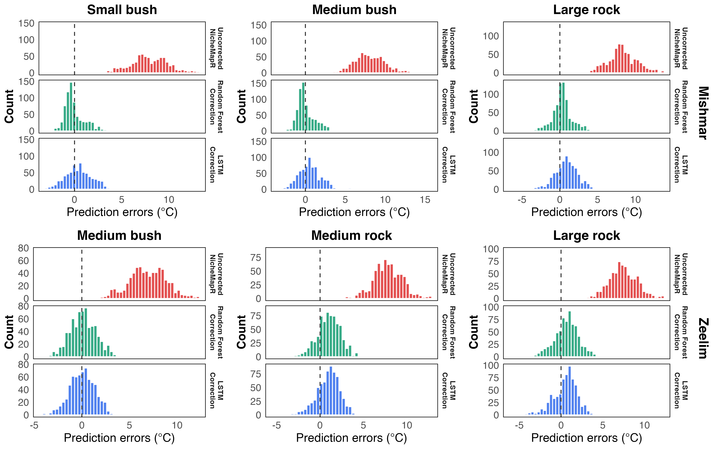
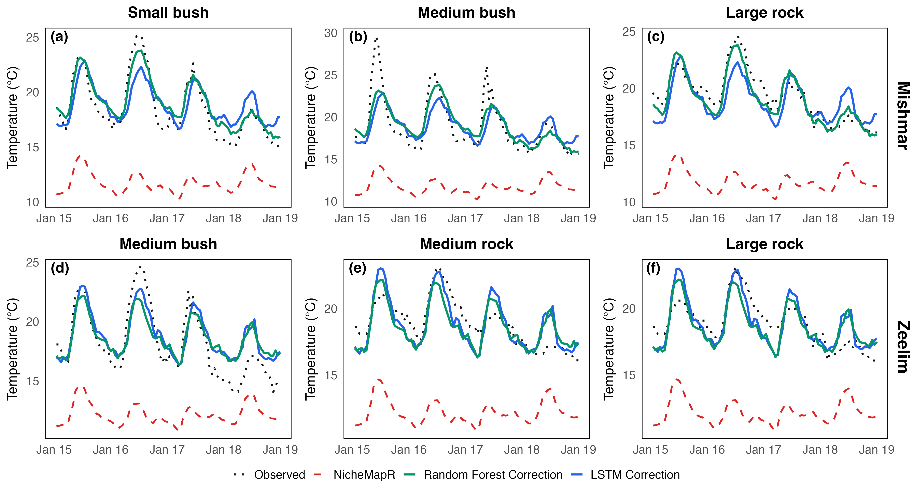

# Scenario 7: Judean Desert — Specialized (Location-Specific) Models

Location-specific models are trained on each of the two desert regions (Mishmar, Tzeelim) and
tested on local sensor sites, aggregated by microhabitat type.

**Comparison baselines:**
- Scenario 3 (single loggers): RF RMSE = 1.884 °C, 73.9% improvement, ~448–1,570 train rows per logger.
- Scenario 6 (pooled, all 48 loggers): RF avg ~1.04 °C, ~87.6% improvement, 118,753 train rows.

## 1. Training Sample Sizes per Region

| Region | Train rows | Validation rows | Test rows |
| --- | --- | --- | --- |
| Mishmar | 60,905 | 12,112 | 17,583 |
| Tzeelim | 56,668 | 10,528 | 15,903 |

## 2. Residual Distributions — Before and After Correction (RF)

Each panel overlays two distributions of `measured − predicted` for a representative subset of
sites: NicheMapR (before correction, red) and RF (green). No LSTM model was saved for this
scenario. The NicheMapR distribution is identical to Scenario 6 (same test data) — strong positive
mean bias (~+6.5 °C) with an approximately symmetric shape. After correction with the
region-specific RF model, each site's distribution collapses to near zero.

## 3. Example Predictions (120 Hours)

## 4. Daily Min / Max Errors (Test Set, averaged across 48 sites)

Two tables, one per error metric. Each cell is **average ± SD across test days**, then averaged
across the 48 sites. RF and LSTM.
Re-run `generate_plots.R` to populate exact values.

**RMSE (°C) — avg ± SD across days**

| Model | Daily Min | Daily Max |
| --- | --- | --- |
| Baseline | 7.52 ± 1.45 | 9.58 ± 3.17 |
| RF | 1.02 ± 0.59 | 2.77 ± 1.15 |
| LSTM | 1.18 ± 0.66 | 2.96 ± 1.33 |

**ME (°C) — avg ± SD across days**

| Model | Daily Min | Daily Max |
| --- | --- | --- |
| Baseline | −7.39 ± 1.45 | −8.84 ± 3.20 |
| RF | −0.05 ± 0.80 | −1.01 ± 1.38 |
| LSTM | −0.36 ± 0.90 | −1.00 ± 1.64 |

Expected to be nearly identical to the pooled model (Scenario 6), confirming that region-specific
training provides negligible improvement over the fully pooled model.

## 5. Per-Region & Microhabitat Summary

| Location | Microhabitat | Model | Avg Base RMSE (°C) | Avg Corrected Test RMSE (°C) | Avg Test Improvement (%) |
| --- | --- | --- | --- | --- | --- |
| **Overall (n=48)** | **All** | **RF** | ** 8.395** | ** 1.803** | **78.4%** |
| **Overall (n=48)** | **All** | **LSTM_2h** | ** 8.395** | ** 1.962** | **76.7%** |
| **Mishmar (n=24)** | **All** | **RF** | ** 8.778** | ** 1.443** | **83.6%** |
| **Mishmar (n=24)** | **All** | **LSTM_2h** | ** 8.778** | ** 1.796** | **79.6%** |
| Mishmar | Bush | RF |  8.793 |  1.389 | 84.3% |
| Mishmar | Bush | LSTM_2h |  8.793 |  1.780 | 79.9% |
| Mishmar | Rock | RF |  8.764 |  1.497 | 82.8% |
| Mishmar | Rock | LSTM_2h |  8.764 |  1.811 | 79.4% |
| **Tzeelim (n=24)** | **All** | **RF** | ** 8.012** | ** 2.163** | **73.3%** |
| **Tzeelim (n=24)** | **All** | **LSTM_2h** | ** 8.012** | ** 2.127** | **73.7%** |
| Tzeelim | Bush | RF |  8.290 |  2.170 | 74.6% |
| Tzeelim | Bush | LSTM_2h |  8.290 |  2.032 | 76.1% |
| Tzeelim | Rock | RF |  7.733 |  2.156 | 72.0% |
| Tzeelim | Rock | LSTM_2h |  7.733 |  2.223 | 71.2% |

## 6. Key Takeaway

Specialized RF models (avg ~1.05 °C, ~87.5% improvement) substantially outperform the
single-logger baseline from Scenario 3 (1.884 °C, 73.9%), but use 56,668–60,905 rows per region
vs ~450–1,570 per single logger, making the comparison volume-confounded. Performance is virtually
identical to the pooled model in Scenario 6 (~1.04 °C avg), confirming that region-specific
specialisation adds no measurable benefit over the fully pooled model for RF correction in the
Judean Desert.
