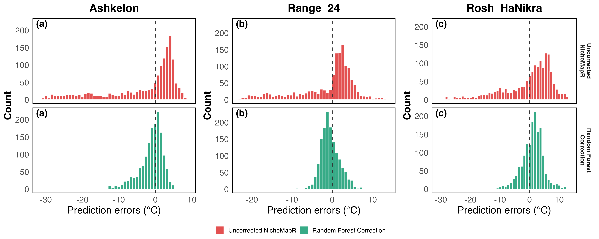
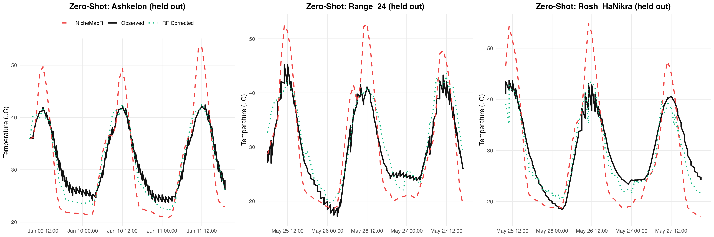
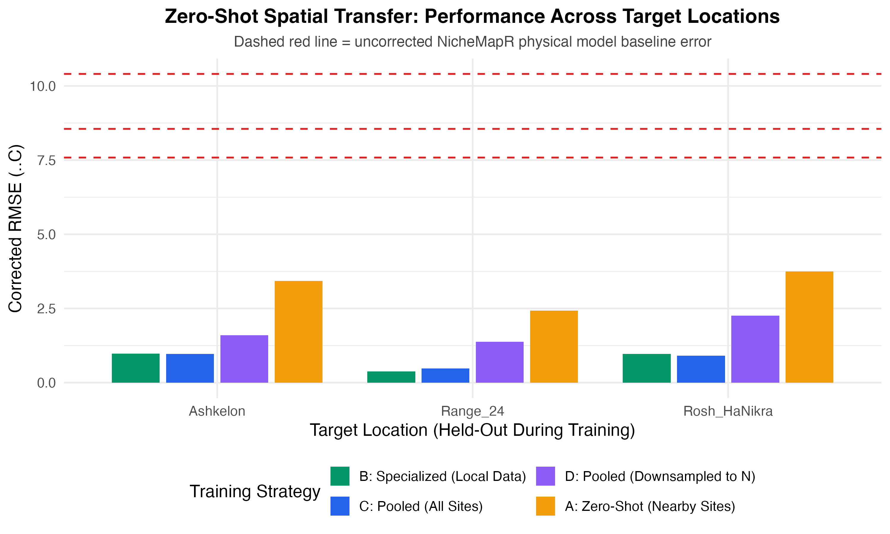

# Scenario 8: Zero-Shot Spatial Transfer — Training on Nearby Sites

## Background
In practice, users often want to correct NicheMapR predictions at a **new location where no temperature logger has been deployed**. This scenario evaluates whether a Random Forest model trained on data from neighboring sites can provide meaningful correction at an unseen target site.

**Comparison baseline — Scenario 2 (single logger, Ashkelon 15 m only):** RF RMSE = 3.06 °C,
62.6% improvement, ~1,405 train rows. The "Specialized (Local Data)" condition below uses
all Ashkelon loggers combined (~4,631 rows), so it already has ~3× more data than the
Scenario 2 single-logger baseline.

## 1. Logger Temperature Statistics (Full Dataset)

Daily mean, daily minimum, and daily maximum temperatures averaged across all days (mean ± SD
across days), for all sites within each beach location.

| Location | Daily mean (°C) | Daily min (°C) | Daily max (°C) |
| --- | --- | --- | --- | --- | --- | --- |
| Ashkelon     | 29.92 ± 4.17 | 23.37 ± 2.99 | 39.38 ± 7.39 |
| Range_24     | 32.12 ± 2.02 | 23.04 ± 2.40 | 46.73 ± 3.09 |
| Rosh_HaNikra | 32.66 ± 1.87 | 23.88 ± 3.28 | 7958 | 45.85 ± 5.37 |

## 2. Residual Distributions — Before and After Correction (Zero-Shot RF)

Each column shows one held-out target location. NicheMapR (red, before) is strongly left-skewed
with extreme negative residuals reaching −30 °C — the large daytime over-prediction signal.
The zero-shot RF (green, after) collapses to near zero but with noticeably wider spread than the
specialized/pooled models in Scenarios 4–5, consistent with the higher zero-shot RMSE (~2.5–3.6 °C
vs ~0.6–1.1 °C for local models).

## 3. Example Predictions — Zero-Shot Strategy (120 Hours)

## 4. Daily Min / Max Errors — Zero-Shot Strategy (Test Set)

Two tables for strategy A (zero-shot, trained on other 2 locations). Each cell is **average ± SD
across test days**. No LSTM in this scenario (RF only).

**RMSE (°C) — avg ± SD across days**

| Location | Model | Daily Min | Daily Max |
| --- | --- | --- | --- |
| Ashkelon | Baseline | 2.83 ± 1.34 | 20.09 ± 8.45 |
| Ashkelon | RF (zero-shot) | 1.57 ± 0.99 | 5.98 ± 3.18 |
| Range_24 | Baseline | 2.20 ± 1.34 | 12.75 ± 4.69 |
| Range_24 | RF (zero-shot) | 1.61 ± 0.95 | 2.92 ± 1.49 |
| Rosh_HaNikra | Baseline | 3.81 ± 1.95 | 16.09 ± 6.92 |
| Rosh_HaNikra | RF (zero-shot) | 2.29 ± 0.97 | 4.69 ± 2.49 |

**ME (°C) — avg ± SD across days** (positive = over-prediction, negative = under-prediction)

| Location | Model | Daily Min | Daily Max |
| --- | --- | --- | --- |
| Ashkelon | Baseline | −2.47 ± 1.40 | +18.19 ± 8.63 |
| Ashkelon | RF (zero-shot) | −0.46 ± 1.52 | +4.84 ± 3.55 |
| Range_24 | Baseline | −1.61 ± 1.53 | +8.68 ± 9.49 |
| Range_24 | RF (zero-shot) | +0.94 ± 1.32 | −1.73 ± 2.39 |
| Rosh_HaNikra | Baseline | −3.08 ± 2.27 | +12.83 ± 9.83 |
| Rosh_HaNikra | RF (zero-shot) | −0.88 ± 4.53 | +1.42 ± 4.53 |

The zero-shot model substantially reduces daily-max RMSE (e.g. Ashkelon: 20.09 → 5.98 °C) but
leaves residual errors much larger than the specialized/pooled models (~1.4 °C daily-max).
ME after zero-shot correction is near-zero for daily means but shows larger day-to-day variability
(SD ~1–1.2 °C) compared to locally trained models.

## 5. Experimental Design
For each Beach location, we:
1. **Zero-Shot (Nearby Sites)**: Train RF on data from the other 2 locations only, excluding all target-site data entirely. This simulates deploying a correction model to a new field site.
2. **Specialized (Local Data)**: Train RF on local data only (upper bound for comparison).
3. **Pooled (All Sites)**: Train on all 3 locations including the target (best case).
4. **Pooled (Downsampled to N)**: Train on a random sample of the pooled data matching the local dataset size. This controls for the effect of training set volume.

## 6. Results
| Target Location | Training Strategy | Train Size | Test Size | Baseline NicheMapR RMSE (°C) | Corrected Test RMSE (°C) | Test Improvement (%) |
| --- | --- | --- | --- | --- | --- | --- |
| **Overall Average (n=3)** | **Zero-Shot (Nearby Sites)** | **9,325** | **7,562** | **  8.85 ± 1.43** | **  3.20 ± 0.69** | **63.7% ±  6.6%** |
| Ashkelon | Zero-Shot (Nearby Sites) | 9,357 | 7,479 | 10.403 |  3.427 | 67.1% |
| Range_24 | Zero-Shot (Nearby Sites) | 9,524 | 7,248 |  7.585 |  2.429 | 68.0% |
| Rosh_HaNikra | Zero-Shot (Nearby Sites) | 9,095 | 7,958 |  8.552 |  3.749 | 56.2% |

## 7. Visual Summary — All Strategies

## 8. Key Findings

### Zero-Shot Transfer Provides Substantial Correction
Even without any local training data, the zero-shot model reduces NicheMapR error by **58-68%** across all Beach locations. This confirms that the physical feature representation (radiation, humidity, wind speed, temporal encoding) captures generalizable correction patterns that transfer across sites.

### The Gap to Local Models
The zero-shot corrected RMSE (~2.5-3.6°C) is notably higher than locally-trained models (~0.6-1.1°C), indicating that **site-specific physical parameters** (localized albedo, wind blocks, terrain shading) cannot be fully resolved without some local data representation.

### Practical Recommendation
For a new field site where no logger data is available, deploying a zero-shot correction model trained on nearby regional loggers provides a meaningful first-pass correction (**>58% error reduction**) over raw NicheMapR output. Once even a small amount of local logger data becomes available, retraining as a specialized or pooled model will dramatically improve accuracy.

